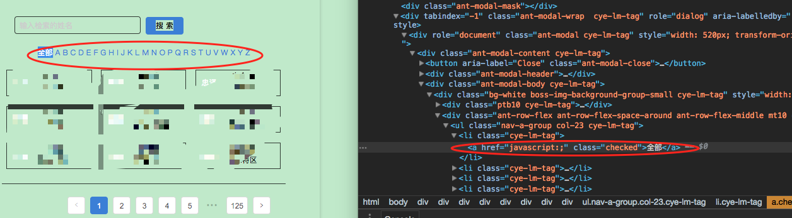
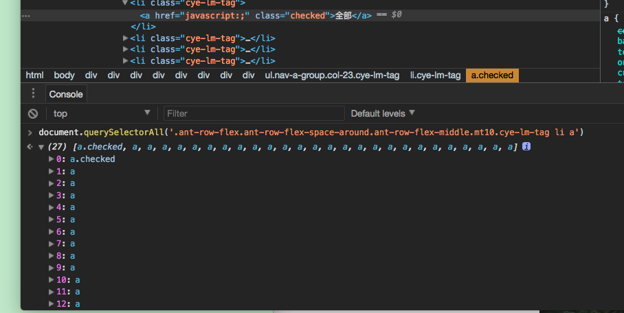
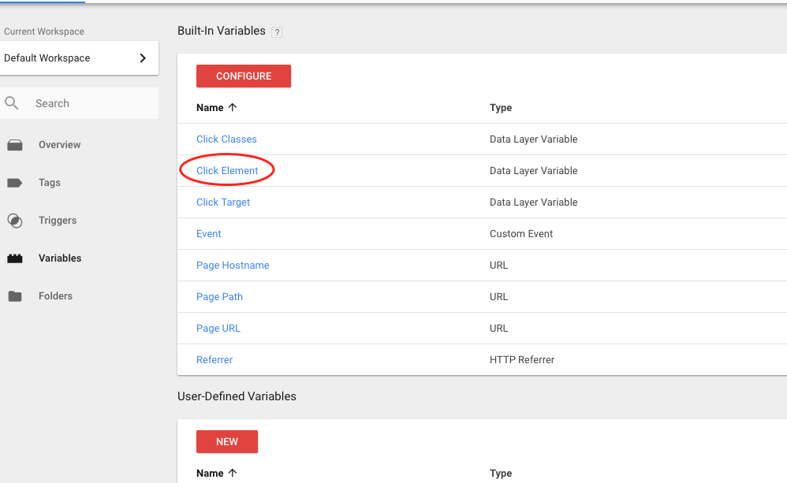
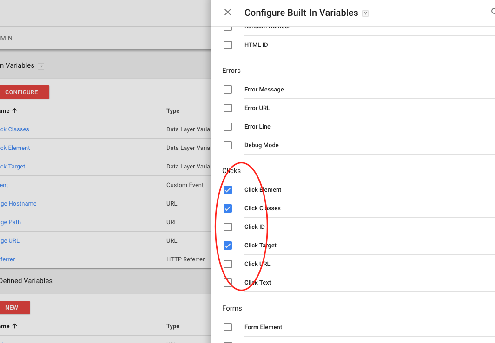
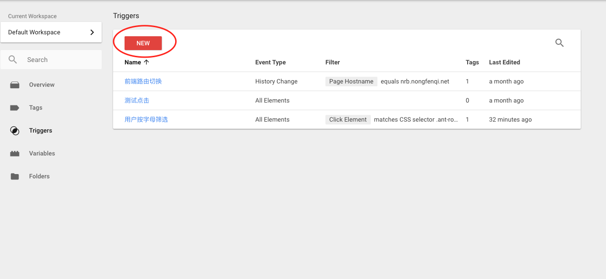
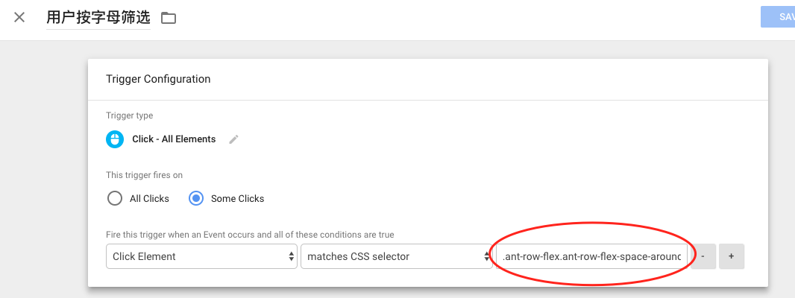
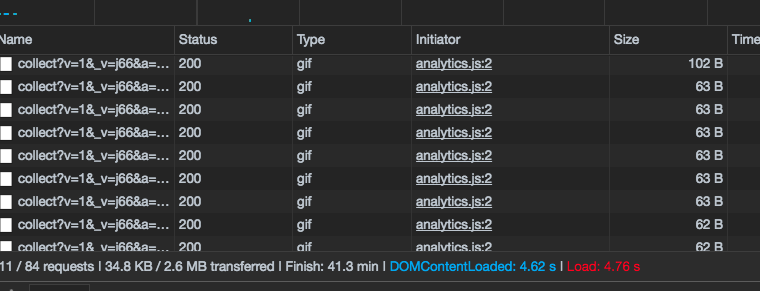

Html页面元素监控
-------------------
在Web上分析用户行为习惯的时候，时常需要关注用户是否对某个页面元素(element)进行了点击操作，这个时候就需要监控这个页面元素的点击事件了。
在GTM中，添加一个页面元素监控是非常简单的，按照如下步骤就可以完成。

### 网页中寻找能页面元素
例如我们相对下图中按字母筛选的功能进行跟踪点击事件，我们打开浏览器的调试模式，然后选中到该元素,a标签就是我们关心的元素，我们需要通过css selector筛选出所有的a标签。通过命令行我们尝试使用querySelectorAll来测试我们的筛选规则。  

> '.ant-row-flex.ant-row-flex-space-around.ant-row-flex-middle.mt10.cye-lm-tag li a'的意义是 在拥有.ant-row-flex.ant-row-flex-space-around.ant-row-flex-middle.mt10.cye-lm-tag 样式的元素中 所有子元素中的li元素中的所有a元素  

确认好能够筛选到我们想要的元素的筛选条件`.ant-row-flex.ant-row-flex-space-around.ant-row-flex-middle.mt10.cye-lm-tag li a` 后记下来，后面的步骤需要用到。

### 开启Click Element内置变量
如果已经有了，则可以跳过这步。   
登陆gtm,进入Variables，点击configure找到Clicks下的Click Element,勾选上,保存好。 

### 添加Triggers
进入Trigeers配置，点击New添加一个Trigger  

Trigger配置如下  

红框选中的css筛选条件就是第一步中得到的条件，把它填写进去，然后保存。

### 添加Tags 
按照如下配置我们的Tag, Trigger就是我们上一步保存的。

### Submit我们的Tag
点击右上角的SUBMIT，一路按照提示提交到线上环境

### 测试一下  
刷新下我们的页面，点击我们监控的元素，并产看调试器，会发现没点一次就会多一次网络请求，说明我们的配置已经生效了。

### references
[谷歌分析](https://gitniko.gitbooks.io/yalvsme/content/google_analytics.html)  
[querySelectorAll](https://developer.mozilla.org/zh-CN/docs/Web/API/Element/querySelectorAll)  

