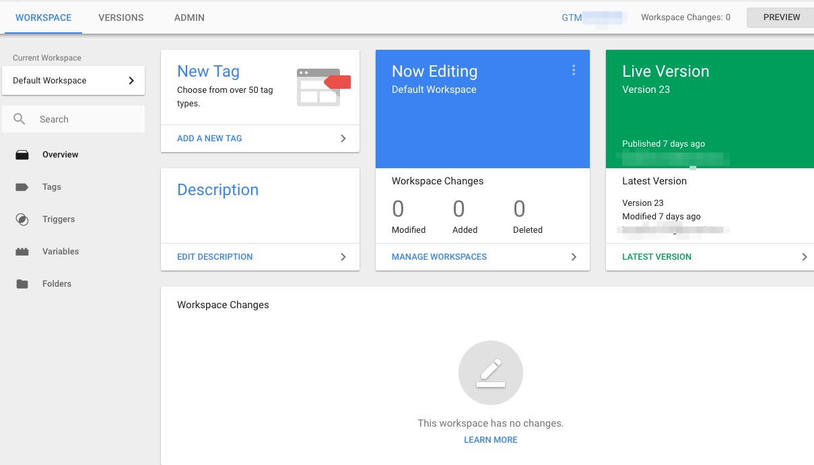
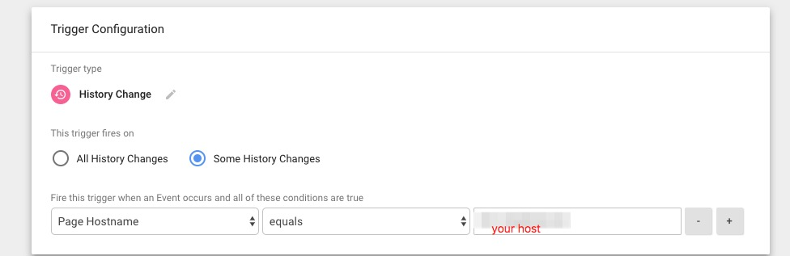
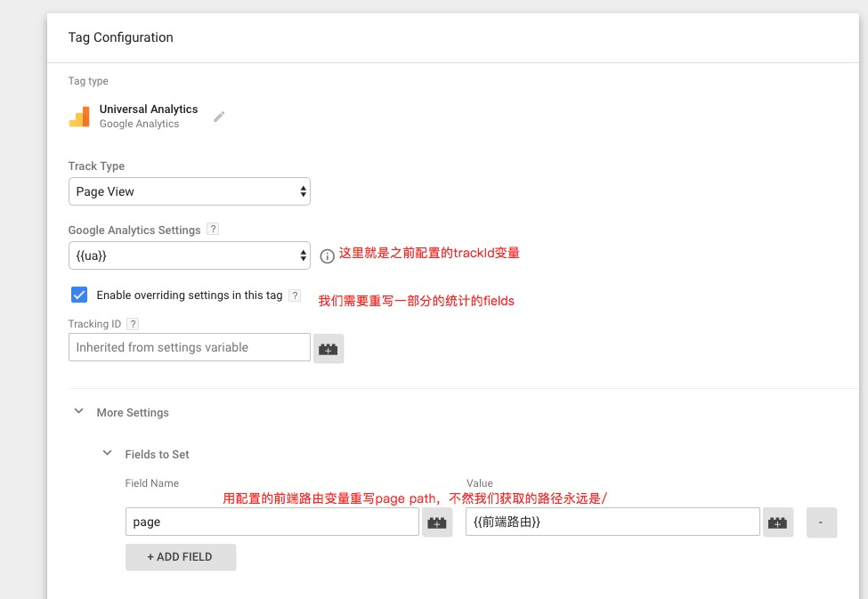
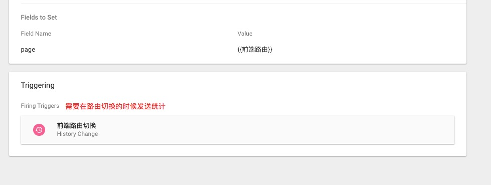

Google Tag Manager
=======================
SPA(single page web application)在网站流量分析上远不如静态页面那么方便，静态页面可以直接在Html标签上加上统计的代码(百度统计，CNZZ，GA之类的)就可以统计到用户各个页面的访问量，停留时间等等。然而SPA通常使用的是HashRouter(/#/somerouter)的这种方式，这样统计代码就无法统计到页面其他的前端路由的访问了。

## 传统的网站的统计方式
浏览器通过地址`https://xxx.xx/login`访问内容，然后再访问另一个内容的时候不会停留在当前页面，而是会再请求新的页面`https://xxx.xx/home`。这样统计代码只需要插入到每个返回的页面里面就可以了。每次页面被浏览器加载后，统计代码都会执行一下，然后发送当前页面的一些信息给统计服务器(例如 title, path, 访问时间等等)。这样就足够统计分析用户的基本行为了。

## SPA的统计方式
浏览器一次加载好前端的所有资源，通过前端路由的方式(https://xxx.xx/#/login)区分各个页面, `#`后面的内容是不会发送给服务器的。后续的页面切换都只是在一个文档流(document)中完成的,不会再从服务器获取文档。所以统计代码只会加载一次，那么只会又一次统计请求的发送，只会发送第一次访问的时的信息(title,path都是固定的),而事实上用户在多个页面上跳转了,但是却无法统计到这些行为。

当然，这也是有相对应的解决方法。一般统计代码都会暴露出对应的接口，让开发者能够主动发送统计请求。所以，一般会在通过`HashChangeEvent`的方式添加一个监听函数，只要是路由有变化就调用一下统计接口。

*如果前端路由使用`HistoryAPI`则可以省略下文中获取前端路由的配置。*

## GTM(Google Tag Manager)
上面的解决方案并不合理，显式的调用统计接口的逻辑明显会`污染`我们的代码，当统计内容，统计接口改的时候我们还需要更新我们的代码。如果代码重构，还需要考虑到这方面的逻辑。  

幸运的是我们能够用`Google Tag Manager(跟踪代码管理器)`了!  

基于`Google Analytics`,`GTM`可以有效的管理我们用于统计的代码了, 最大的好处就是我们的统计代码是实时的被加载的。我们在`GTM`上配置好统计代码,点击发布后 嵌入页面的统计代码也会`更新`成最新的。我们可以放心的把调用统计接口的逻辑从我们的项目中剔除出去了。

## 机制
页面加载的时候会通过`tagId`异步加载统计代码,这些代码中包含了我们在`Google Tag Manager`服务器上配置的内容（包括自定义的代码），并且官网上提供了一套简单的操作就可以添加各种追踪代码，不需要在手写JS代码。  

## GTM中的名词解释
### tag
> A tag is a snippet of code that sends information to a third party, such as Google.  

其实就是用来收集信息并发送给第三方平台的片段代码。

### trigger
>A trigger is a condition that evaluates to either true or false at runtime. It does this by comparing the value in a variable with the value that you specified when you defined the trigger  

页面上的触发器，可以监听页面的状态变换和事件（DOM Ready, Click, History Change, JavaScript Error等)

## variables
>A Tag Manager variable is a configured name-value pair for which the value is populated during runtime. 
变量，可以在配置trigger和tag的时候使用。预设了很多变量(Page Path, Page URL等), 还可以自定义一个返回一个值的函数作为变量。

## GTM使用
进入`tagmanager.google.com`开启自己的账号，跟随引导创建`container`后进入到主页面`workspace`

### 获取GTM-XXX容器编号和代码片段
在截图又上有个GTM-xxx的链接,打开后会弹出片段代码,按照提示插入到我们的网页中。  

  

### 点右上角发布我们的代码片段
按照提示一路操作下去直到发布成功,然后启动我们的网页,查看请求gtm的请求是否成功返回,如果成功返回则基本配置完成,不需要再修改我们的网页代码了。

### 配置Variables
进入`Variables`的配置单中,增加一个`User-Defined Variables`。选择`variable type`为`Google Analytics Settings`。`Tracking ID `就填谷歌分析中的ID(因为我们用的分析平台是谷歌分析)。这个变量以后会经常用到。

在配置一个变量，用来获取前端路由。选择`variable type`为`Custom JavaScript`并填入以下代码片段。  
```js
  function() {
    // 获取#后的字符串
    return window.location.hash.replace('#', '').split('?')[0]
  }
```

### 配置Triggers
进入`Triggers`配置单中,增加一个`Trigger`,并选择`Trigger Type`为`History Change`(也就是window.history变化时会被触发)  

  


### 配置Tags
按照下图配置一份Tags  





### 再次发布
完成后,再刷新我们的页面就可以看到效果。每一次路由变化就会有一个发送到`google-analytics`的请求。


## references
[Tag management system](https://en.wikipedia.org/wiki/Tag_management_system)
[History API](https://developer.mozilla.org/en-US/docs/Web/API/History_API)