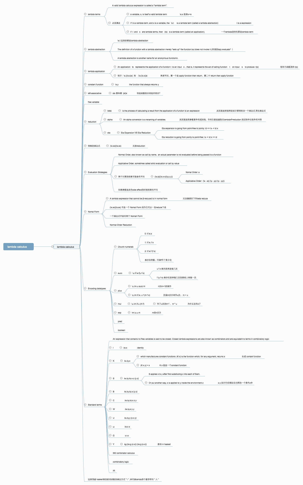

# lambda阶段总结 
为了能够更好的掌握函数式编程，最近对`lambda calculus`进行了基础的学习。主要参考wiki，[columbia大学教材的](http://www.cs.columbia.edu/~sedwards/classes/2012/w4115-summer/lambda.pdf)以及[ucsc的教材](https://classes.soe.ucsc.edu/cmps112/Spring03/readings/lambdacalculus/introduction.html)。
这两篇都是入门的极佳教材。而wiki上的更加全面，但是比较难以理解。先看完两份教材后再回过头扫了下wiki作为知识梳理和补充。顺手作出了下面的思维导图


## Y combinator 
作为函数式编程入门标志，还是有必要做一次 Y combinator的推导。先来份lambda calculus的推导。  
```hs
-- y combinator的推导
-- := 符号只是个命名而已
-- 一般的递归函数 fac 5
fac := \n. if n == 0 then 1 else n * fac (n - 1)

-- 把递归函数本身作为参数传进来
fac := \g.\n if n == 0 then 1 else n * g g (n - 1)
-- 这样就可以 fac fac 5 的调用

-- 消除两次fac的调用
fac := (\g.\n if n == 0 then 1 else n * g g (n - 1))(\g.\n if n == 0 then 1 else n * g g (n - 1))
-- 这样就可以 fac 5 了

-- 把 g g 这个提取成参数 m, 把 内部的 g g作为值分离出来
fac := (\g.(\m.\n if n == 0 then 1 else n * m (n - 1))(g g))(\g.(\m.\n if n == 0 then 1 else n * m (n - 1))(g g))


-- 需要一般化我们的递归
-- 提取出 (\m.\n if n == 0 then 1 else n * m (n - 1)) 为 fac'
fac' := (\m.\n if n == 0 then 1 else n * m (n - 1))
-- fac 就可以写成
fac := (\g.fac' (g g))(\g.fac' (g g))


-- 再把fac' 提取成参数
fac := \f.(\g.f (g g))(\g.f (g g)) fac'

-- 把 \f.(\g.f (g g))(\g.f (g g)) 提取出来就是一般化的函数了，也就是我们想要的
y := \f.(\g.f (g g))(\g.f (g g))

-- 使用我们的y
-- fac 5 就可以这样写
y fac' 5

```  
随后在es6上实现一次，然后过程却出现了一个问题。推导出来的函数并不能运行。先看下我最先的错误的推导
```javascript
// js 中的推导
// 最初的递归
fac = n => n == 0 ? 1 : n * fac(n - 1);
// 去掉调用自己
fac = f => n => n == 0 ? 1 : n * f(f)(n - 1);
// fac(fac)(5)
fac = (f => n => n == 0 ? 1 : n * f(f)(n - 1))(f => n => n == 0 ? 1 : n * f(f)(n - 1))
// fac(5)
fac = (f => (m => n => n == 0 ? 1 : n * m(n - 1))(f(f)))(f => (m => n => n == 0 ? 1 : n * m(n - 1))(f(f)))
// 请原谅我是用facp 代表 fac' ，JS中'会转换成字符
facp = m => n => n == 0 ? 1 : n * m(n - 1)
fac = (f => facp(f(f)))(f => facp(f(f)))
y = facp => (f => facp(f(f)))(f => facp(f(f)))
y = g => (f => g(f(f)))(f => g(f(f)))
// 调用 fac 5
(y(facp))(5)
// ...Maximum call stack size exceeded
```  
怎么会这样呢？实际上是忽略了一个重要问题，JS的`Evaluation Strategies`和lambda有很大区别的，也就是JS是先执行参数内的表达式后传递给函数去执行（被称为`Applicative Order,`，而我们默认的`Evaluation Strategies`是`Normal Order`  
>Normal Order, also known as call by name,  an actual parameter is not evaluated before being passed to a function  

正确的JS
```javascript
y = f => (y => f(x => y(y)(x)))(y => f(x => y(y)(x)))
// 错误的
y = f => (y => g(y(y)))(y => g(y(y)))
// 为什么f(f)需要延迟执行，即再执行前先传给g ？
// 看一下错误的执行过程
////////////////////////////////////////////////////
(f => (y => f(y(y)))(y => f(y(y)))) p (5)
(   (y => p(y(y)))(y => p(y(y)))  ) (5)
(   p(    (y => p(y(y)))((y => p(y(y))))   )  ) (5)
(   p(    (p  ((y => p(y(y)))((y => p(y(y))))) )   )  ) (5)
// ...Maximum call stack size exceeded
// 我们的p根本就没进去，自然也无法触发这个 0 == n 的终止条件了
// 正确执行过程
///////////////////////////////////////////////////
(f => (y => f(x => y(y)(x)))(y => f(x => y(y)(x)))) p (5)
(y => p(x => y(y)(x)))(y => p(x => y(y)(x))) (5)
(p ( x => (y => p(x => y(y)(x))) ( (y => p(x => y(y)(x))) )(x) )  ) (5)
// 注意 (x => (y => p(x => y(y)(x))) ( (y => p(x => y(y)(x))) )(x)) 这个表达式是个函数定义,里面的内容只会被传入到p 中才会执行
// 由于 p = m => n => n == 0 ? 1 : n * m(n - 1)
((m => n => n == 0 ? 1 : n * m(n - 1)) ( x => (y => p(x => y(y)(x))) ( (y => p(x => y(y)(x))) )(x) )  ) (5)
(n => n == 0 ? 1 : n * ( x => (y => p(x => y(y)(x))) ( (y => p(x => y(y)(x))) )(x) )(n - 1))  (5)
// 然后 5被传进来
5 == 0 ? 1 : 5 * ( x => (y => p(x => y(y)(x))) ( (y => p(x => y(y)(x))) )(x) )(5 - 1)
5 * ( x => (y => p(x => y(y)(x))) ( (y => p(x => y(y)(x))) )(x) )(4)
5 * (y => p(x => y(y)(x))) ( (y => p(x => y(y)(x))) )(4)
// ... 最终出发 0 == 0中断
```
这个问题引起了我对pointfree在JS中使用的问题，本身`f(x => y(y)(x))` 就是 `f(y(y))` poinftfree下的结果，大部分场景都是相同的，
但是在JS这类优先解析参数表达式的语言中，`f(x => y(y)(x))` 并不是 `f(y(y))`完全等价的，这点以后在使用pointfree风格时候需要多注意了。    

当然JS中还有另外一种可能[避免以上错误的推导方式](https://blog.jcoglan.com/2008/01/10/deriving-the-y-combinator/)
