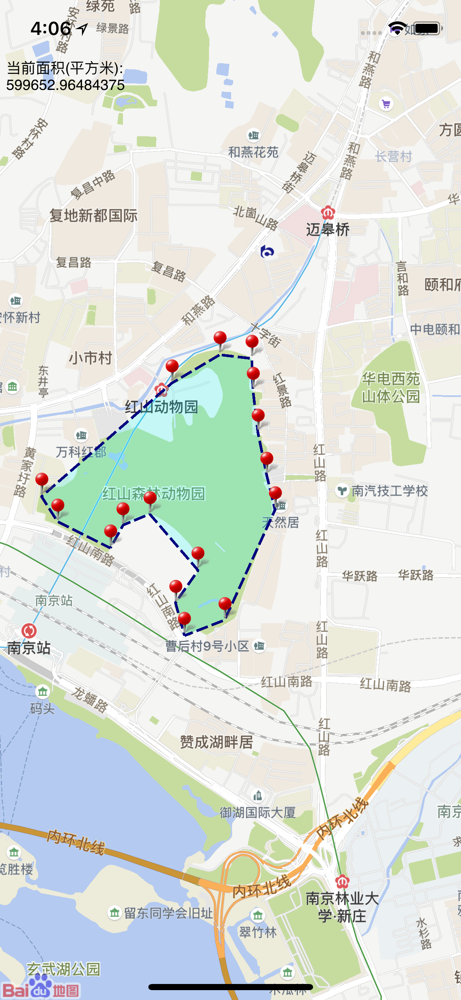
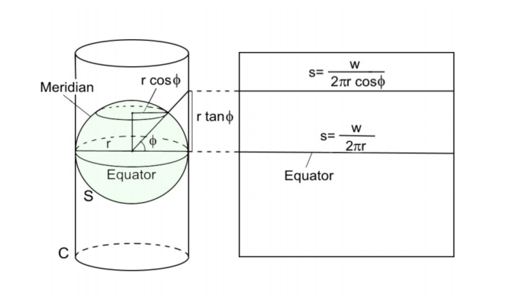
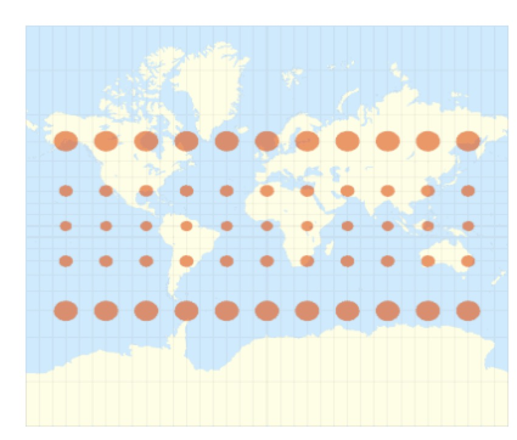
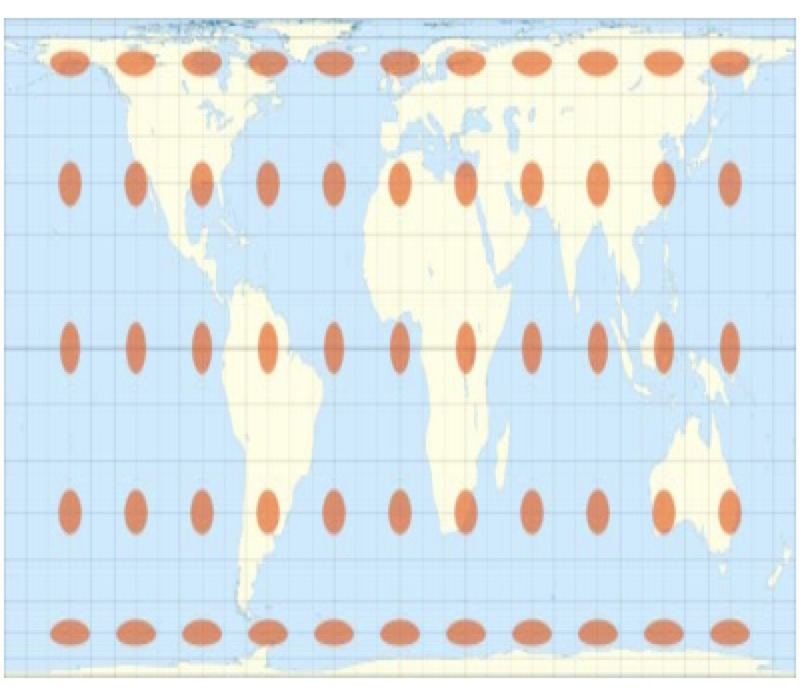
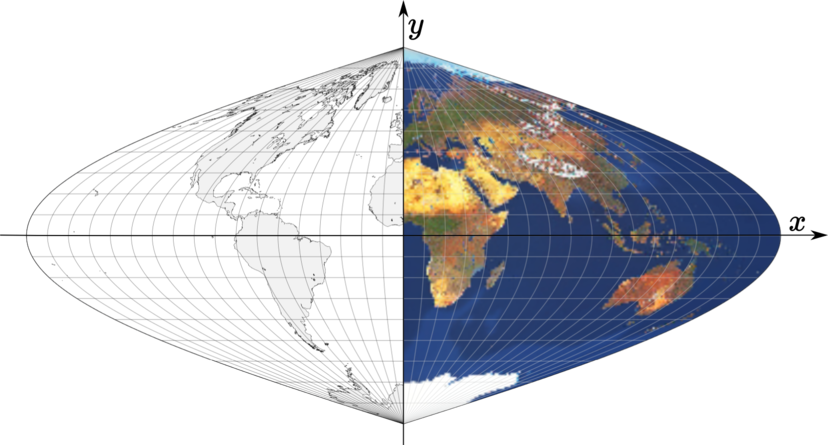
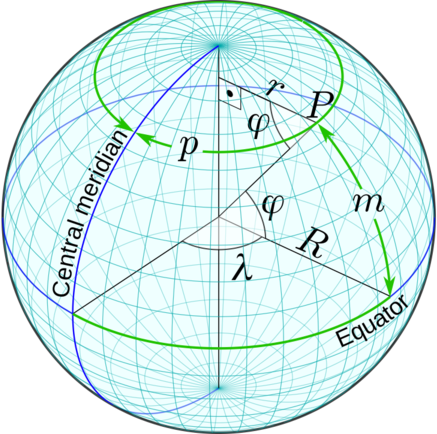

测亩仪
==============================
通过在地图上标记点，围成多边形后，给出该多边形区域的实际地里面积。

 

## 交互设计
- 长按标点，点之间连线围成区域。


## keyword
- 多边形面积计算
<!-- - 格林公式 -->
- 地图绘制线和面
- equator(赤道), merdian(经线)
- Tissot’s indicatrix
- Mercator projection
- Sinusoidal projection

## 方法
- 通过经纬度转换成平面坐标后再计算多边形面积(选用该方法)
- 通过经纬度直接计算球面围成的多边形面积

## 地图投影类型
`Carl Friedrich Gauss`得出一个球面无法在一地图上进行无损展示(a sphere’s surface cannot be represented on a map without distortion)。
所以根据损失类型来分类的话主要有以下三种类型:   
- Equal-area projections(等面积投影)
- Conformal projections(保角投影)
- Conventional projections(以上两种都有)

## Mercator projection
> 通过圆心投影到圆柱上后，平铺圆柱，形成平面坐标。特点是:非等面积，不是适合用于面积计算, 常用于地图导航上面    

  

以下假设$\phi$和$\lambda$都是弧度单位,$\lambda = 0$的时候处在格林威治子午线, $\phi = 0$处在赤道  
在equator(赤道)处水平比例应该是 $s = w/(2\pi R)$  
在latitidue(纬度)为 $\phi$ 的位置时，水平比例: 

$$
s _ { h } = \frac { w } { 2 \pi R \cos \phi } = s \sec \phi 
$$

x轴:  

$$
x = \frac { w \lambda } { 2 \pi }
$$

y轴: 

$$
y = f ( \phi )
$$

特别的，当周长等于地图的宽度时($2\pi R = w$), $y = R\tan \phi$  

在球面上$\phi$和$\phi_{1}$所对应的弧长差为:  

$$
R \left( \phi _ { 1 } - \phi \right)
$$

那么对应的地图上y的距离差就是$f(\phi_{1}) - f(\phi)$ 所以比例应该是:

$$
s _ { v } = \frac { 1 } { R } f ^ { \prime } ( \phi ) = \frac { 1 } { R } \lim _ { \phi _ { 1 } \rightarrow \phi } \frac { f \left( \phi _ { 1 } \right) - f ( \phi ) } { \phi _ { 1 } - \phi }
$$

`Mercator projection` 就是令水平比例等于垂直比例:  

$$
f ^ { \prime } ( \phi ) = \frac { w } { 2 \pi } \sec \phi
$$

根据积分表解出来:  

$$
y = f ( \phi ) = \frac { w } { 2 \pi } \ln | \sec \phi + \tan \phi |
$$

可以看出上下两集的面积都是拉大的，但是形状是不变的  
  


## Lambert projection
如果要保持面积不变那么需要$s_{v} * s_{h} = c$ 也就是保证相乘等与一个常数， 那么: 

$$
f ^ { \prime } ( \phi ) \sec \phi = c
$$

然后解出来:  

$$
y = \frac { w } { 2 \pi } \sin \phi
$$

可以看出来变形了:  



## Sinusoidal projection



考虑球面一点$P$, 它距离赤道的表面距离是$m = \phi R$(弧度乘以半径=对应的弧长),以此距离作为地图的纵坐标。



$P$点到中心子午线的的"距离"作为很横坐标, 显然这段距离为$p = R\lambda\cos\phi$  
因此可以得出公式:  

$$
x = R \lambda \cos \phi 
$$
$$
y = R \phi
$$


## 多边形面积
### 公式
$$
S  = \frac { 1 } { 2 } \sum _ { k = 1 } ^ { m } \left( x _ { k } y _ { k + 1 } - x _ { k + 1 } y _ { k } \right)
$$


## 算法实现及测试数据
```swift
func * (lhs:(Double, Double), rhs:(Double, Double)) -> Double {
    return lhs.0 * rhs.1 - rhs.0 * lhs.1
}

func toRadians(degree: Double) -> Double {
    return degree * Double.pi / 180
}

let radius = 6371000.0
let lambda0 = toRadians(degree: 0.0)
let phi0 = toRadians(degree: 0.0)
let phi1 = toRadians(degree: 0.0)
let phi2 = toRadians(degree: 60.0)

// Lambert projection
func lambert2car(latitude:Double, longtitude:Double) -> (Double, Double) {
    return (radius * longtitude, radius * sin(latitude))
}


// Sinusoidal projection
func sin2car(latitude:Double, longtitude:Double) -> (x:Double, y:Double) {
    return (longtitude * radius * cos(latitude), latitude * radius)
}


func areaOfPolygon(vertics:[(Double, Double)]) -> Double {
    var polygonVertics = [(Double, Double)]()
    polygonVertics.append(contentsOf: vertics)
    polygonVertics.append(vertics.first!)
    let sum = polygonVertics.reduce((pre:(0.0, 0.0), sum: 0.0)) { (acc, x:(Double, Double)) -> ((Double, Double), Double) in
        return (pre: x, sum: acc.1 + acc.0 * x)
    }
    
    return sum.1 * 0.5
}

func runTest(data: [(testData: [(x:Double, y:Double)], validation: Double)], projections: [(Double, Double) -> (Double, Double)]) -> Void {
    for projection in projections {
        print("0000000000000000")
        for unit in data {
            let result = areaOfPolygon(vertics: unit.testData.map({ (vector) -> (Double, Double) in
                return (toRadians(degree: vector.0), toRadians(degree: vector.1))
            }).map({ (latitude, longtitude) -> (Double, Double) in
                return projection(latitude, longtitude)
            })
            )
            print("========")
            print("result(m^2):", result)
            print("validation(m^2):", unit.validation)
            print("error(m^2):", result - unit.validation)
            print("error rate(%):", (result - unit.validation)/unit.validation * 100)
        }
    }
}

runTest(data: [
        (// 紫金山
            [
                (32.09237231228167,118.85816641151905),
                (32.08888191941637,118.85756559669971),
                (32.091936020465305,118.85310240089893),
                (32.08902735511446,118.84426183998585),
                (32.085754995919906,118.8418585807085),
                (32.08408241152431,118.83396215736866),
                (32.08146439188813,118.83224554359913),
                (32.07840994086831,118.8323313742876),
                (32.07528265908702,118.83138723671436),
                (32.06590017191265,118.82040090858936),
                (32.06581208291123,118.81746443495001),
                (32.064866506642154,118.81694945081915),
                (32.060065737860235,118.82029684766974),
                (32.053446082872,118.81995352491583),
                (32.050899934194696,118.82845076307501),
                (32.044497875968844,118.83102568372931),
                (32.038968465311164,118.8288799165174),
                (32.04180596776272,118.83849295362677),
                (32.03984155235566,118.8482776521131),
                (32.04020533616681,118.85145338758673),
                (32.036058115030464,118.85677489027228),
                (32.036785711273424,118.85909231886114),
                (32.04035084928652,118.85694655164923),
                (32.03955052426596,118.86441382154669),
                (32.04209698868248,118.87248190626349),
                (32.046171184413666,118.87711676344122),
                (32.04937221098288,118.8838115571424),
                (32.05366432089069,118.88664396986212),
                (32.058901877180745,118.88793143018927),
                (32.06362996907811,118.88715895399298),
                (32.065084717418095,118.88990553602423),
                (32.06966702344827,118.88896139845099),
                (32.07461274689404,118.88501318678107),
                (32.08261261546742,118.879777514784),
                (32.09250239412376,118.87497099622931),
                (32.088139388420466,118.87050780042853),
                (32.091993387526806,118.8641563294812)
            ],
            29008610.93),
        (// 凹多边形
            [
                (33.970116789904445,118.29517536591902),
                (33.96335424162145,118.29732113313094),
                (33.96641525113789,118.3102815670909),
                (33.97275068954864,118.3053035515296)
            ], 878292.97),
        (
            [
                (32.08810117348784,118.76541372224733),
                (32.05988202935582,118.766615351886),
                (32.06337352956128,118.8047241775696),
                (32.08897379166003,118.80300756380007),
                (32.0741381495211,118.79236455842897),
                (32.07253808349195,118.7786316482727)
            ], 6594696.67)
    ],
        projections: [sin2car(latitude:longtitude:), lambert2car(latitude:longtitude:)])

```


## 资料
[多边形面积公式推导](https://wenku.baidu.com/view/c6eb44c58bd63186bcebbc2a.html)  
[albers equal-area conic projection](http://mathworld.wolfram.com/AlbersEqual-AreaConicProjection.html)  
[albers project in js](https://gist.github.com/RandomEtc/476238)  
[mercator vs albers](https://gis.stackexchange.com/questions/49210/area-calculation-albers-equal-area-vs-pseudo-mercator)  
[球面三角](https://www.guokr.com/article/98934/)  
[球面多边形面积公式](http://mathworld.wolfram.com/SphericalPolygon.html)  
[正弦投影实现](https://www.periscopedata.com/blog/polygon-area-from-latitude-and-longitude-using-sql)  
[正弦投影证明](http://www.progonos.com/furuti/MapProj/Normal/CartHow/HowSanson/howSanson.html)  
[map projection](https://arxiv.org/pdf/1412.7690.pdf)  
[mapprojection内容更多](http://www.auburn.edu/academic/classes/fory/7470/lab08/understanding%20map%20projections.pdf)  
