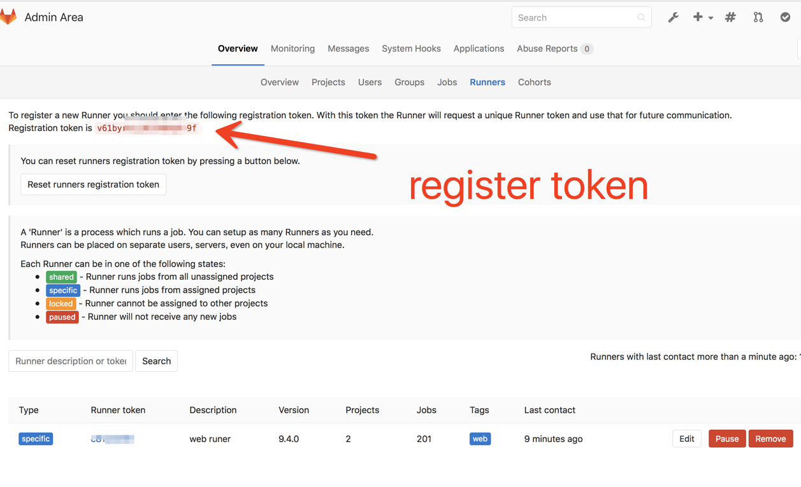
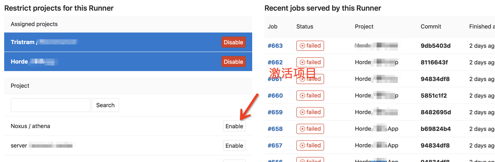
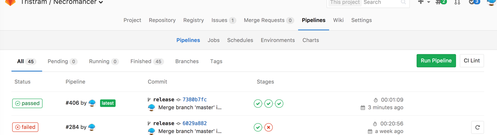
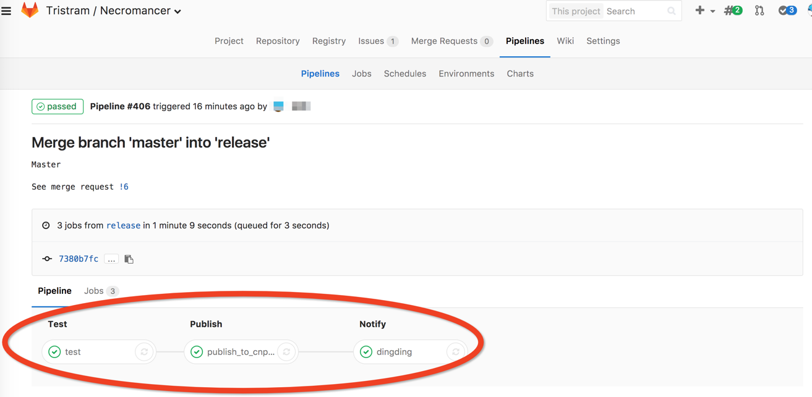
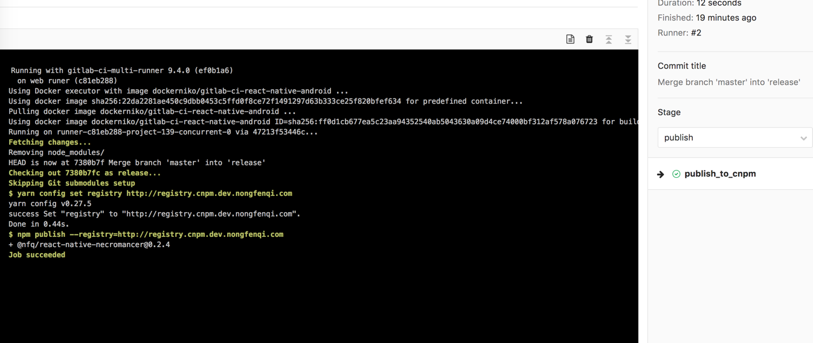

gitlab-ci 接入 runner
=========================================
## 开发流程

## gitlab-ci中的概念
### Pipelines  
几个`stage`串联在一起就构成了一个`pipelines`。每次执行构建的时候会启动这个`pipelines`。

### Stages
定义在`gitlab-ci.yml`中。定义流程的阶段，是`jobs`的一个集合。每个`jobs`会在相应的`stage`中执行，并且这些`jobs`是并行执行的。`stage`可能定义`build`,`test`,`deploy`这种阶段。
### Jobs
定义在`gitlab-ci.yml`中。是一串bash脚本，可以执行我们的编译，测试，部署等一切所需要的任务，就如同我们在本地终端中执行命令一样。  
每一个Job都会重新拉取docker镜像,确保执行Job的系统是一个全新的环境。所以之前执行的Job所产生的文件都无法使用到。 
如果想要使用之前Job的产物则需要是用artifacts的方式。

## 安装docker runner
本身gitlab中并不自带runner, 所以需要单独安装。两者通过gitlab内置的ci系统关联上, 项目仓库中的yaml配置了执行脚本，runner去执行yaml中的jobs内容。  
runner可以在多种平台上安装，我这里选择`docker service`的安装方式。主要安装简单，直接用官方的`docker image`就可以了。安装步骤可以参考最后的参考链接。  
## 注册runner
主要步骤参考最后的链接。这里说下文档中未提及到的注册的token是从哪儿来的。  
登录gitlab管理员账号查看 `setting => overview => runners`

## 激活项目的runner
注册好runner后还需要让我们的项目能够使用runner,还是需要在gitlab管理员账号页面`enable`一下。 


## 使用场景
### 打包react-native adnroid
选择一个配置好android环境和Node.js的环境的[镜像](https://hub.docker.com/r/dockerniko/gitlab-ci-react-native-android/)。然后在仓库根目录下添加`.gitlab-ci.yml`。添加其中加上如下类似的内容。
```yaml
#############################################
# 说明
# job共享变量文件: .jobs
#############################################
# 镜像名称,默认从dockerhub.com上获取
image: dockerniko/gitlab-ci-react-native-android
# 每次执行Job前会执行的脚本
before_script:
  # 导出环境变量
  - export GRADLE_USER_HOME=`pwd`/android/.gradle
  - export ARTIFACTS_URL=${CI_PROJECT_URL}/-/jobs/${CI_JOB_ID}/artifacts/raw/android/app/build/outputs/apk/app-release.apk
# 定义stage
stages:
  - build
  - deploy

# Job名称
android: 
  # Job属于哪个Stage
  stage: build
  script:
    - yarn install --ignore-engines
    - cd ./android && ./gradlew assembleRelease
  # 产物定义，这里的产物是可以被保存下来，不会因为任务执行完而被清空掉
  artifacts:
    # 要保存的目录，改目录下的东西都会被保存下来
    paths:
    - android/app/build/outputs/apk/app-release.apk
    # 保质期,1天后就失效删除
    expire_in: 1 day
  # 缓存，每次执行这个Job的时候会先尝试获取缓存，执行完后再把当前的内容缓存下来
  # 该缓存不能用于Job之间的共享，只能用于android这个Job下
  cache:
    # 会缓存git 没有tracked的文件
    untracked: true
    # 要缓存的文件的路径
    paths:
      - node_modules/
      - android/.gradle/wrapper
      - android/.gradle/caches
      - .yarn
      - ls -l
  # 执行改任务的分支，当以下分支发生变化（merge, commit)的时候会出发Job
  only:
    - develop
    - release
    - test

deploy_apk:
  stage: deploy
  script: 
  # export develop env deployment ftp address
    - echo deploy android
  only:
    - develop
    - release
    - test

```

## gitlab上如何操作
发起merge，然后同意合并后出出发了构建（出发一次pipleline）  
可以看到一行pipleline就是一次构建，其中有构建的状态，点击状态(绿色的passed)可以进入该Pipeline，产看详细的Jobs    
  
看到具体的Jobs,每个Job是可以点击进去查看执行的日志  
  
里面有从头开始执行的记录，可以查看失败的原因  
  
## 相关链接参考
[pipelines and jobs](https://docs.gitlab.com/ee/ci/pipelines.html)  
[git runner install](https://docs.gitlab.com/runner/install/index.html)  
[install in docker](https://docs.gitlab.com/runner/install/docker.html)  
[register runners](https://docs.gitlab.com/runner/register/index.html#docker)  
