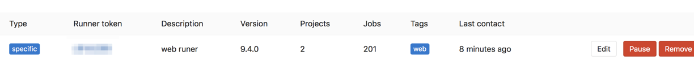

gitlab-ci 接入 runner
=========================================
## 开发流程

## gitlab-ci中的概念
### Pipelines  
几个`stage`串联在一起就构成了一个`pipelines`。每次执行构建的时候会启动这个`pipelines`。

### Stages
定义在`gitlab-ci.yml`中。定义流程的阶段，是`jobs`的一个集合。每个`jobs`会在相应的`stage`中执行，并且这些`jobs`是并行执行的。`stage`可能定义`build`,`test`,`deploy`这种阶段。
### Jobs
定义在`gitlab-ci.yml`中。是一串bash脚本，可以执行我们的编译，测试，部署等一切所需要的任务，就如同我们在本地终端中执行命令一样。

## 安装docker runner
本身gitlab中并不自带runner, 所以需要单独安装。两者通过gitlab内置的ci系统关联上, 项目仓库中的yaml配置了执行脚本，runner去执行yaml中的jobs内容。  
runner可以在多种平台上安装，我这里选择`docker service`的安装方式。主要安装简单，直接用官方的`docker image`就可以了。安装步骤可以参考最后的参考链接。  
## 注册runner
主要步骤参考最后的链接。这里说下文档中未提及到的注册的token是从哪儿来的。  
登录gitlab管理员账号查看 `setting => overview => runners`

## 激活项目的runner
注册好runner后还需要让我们的项目能够使用runner,还是需要在gitlab管理员账号页面`enable`一下。 

## 使用场景
### 打包adnroid/IOS
首先我们要打包
### 发布npm包
### 部署web项目

## 相关链接参考
[pipelines and jobs](https://docs.gitlab.com/ee/ci/pipelines.html)
[git runner install](https://docs.gitlab.com/runner/install/index.html)
[install in docker](https://docs.gitlab.com/runner/install/docker.html)
[register runners](https://docs.gitlab.com/runner/register/index.html#docker)
