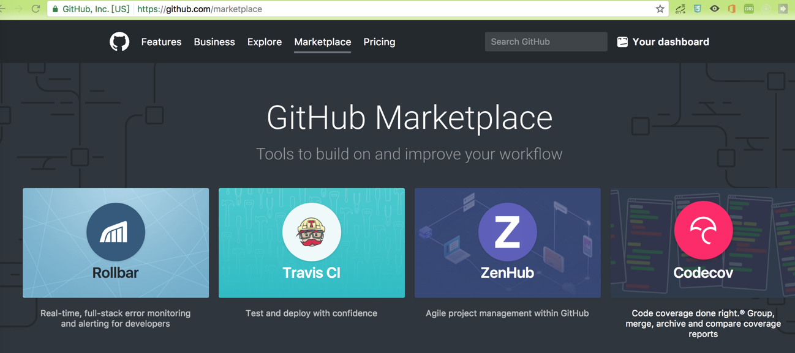
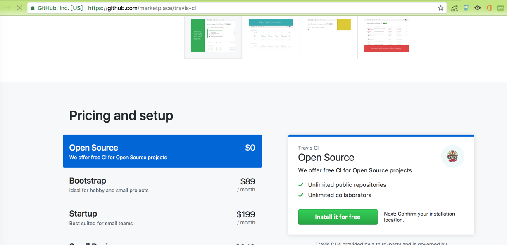
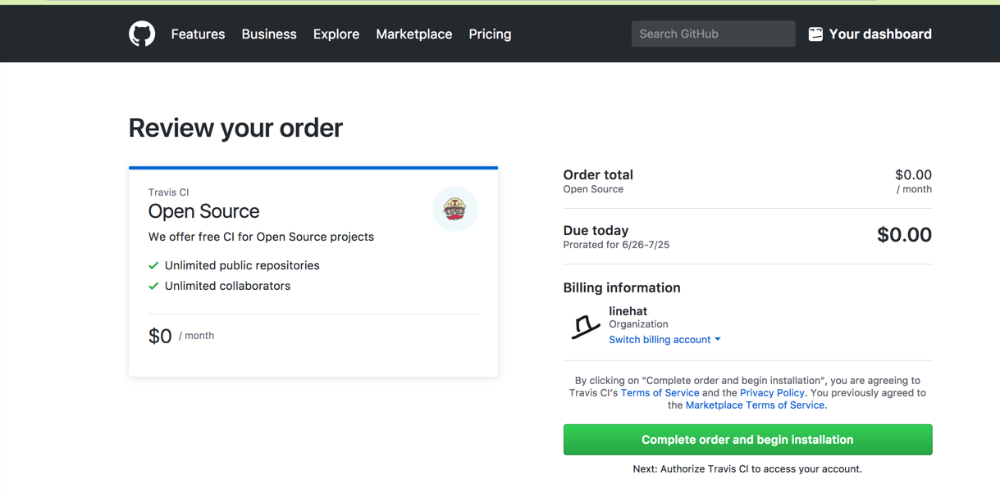
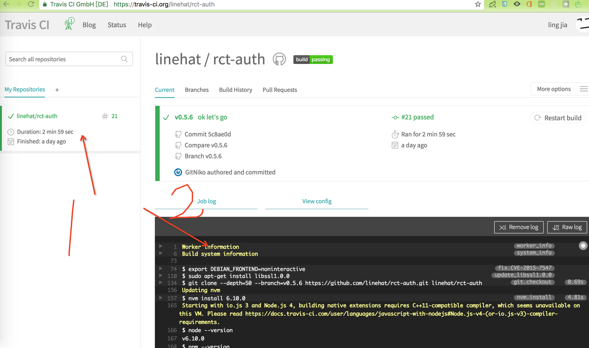
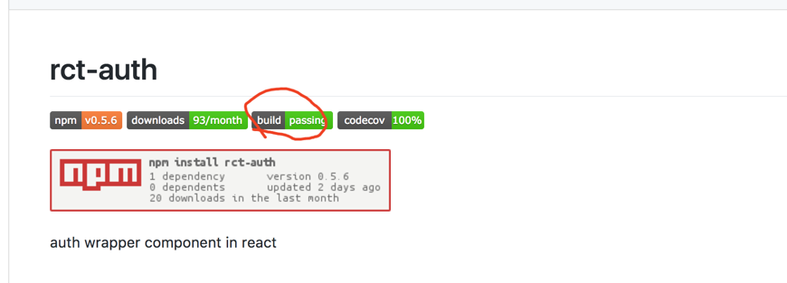

如何接入travis-ci(在Github上的js项目)
=========================
## 目录
* 为什么需要CI
* 为什么选择travis
* 如何配置
* 在README中显示ci的状态
* 接入codecov
* 接入npm自动deploy
* 在README中显示npm status

## 为什么需要CI
...http://www.ruanyifeng.com/blog/2015/09/continuous-integration.html
## 为什么选择travis
类似的服务可以选择[circleci](https://circleci.com/), jenkins。想对与前两个[travis](https://travis-ci.org),没有执行速度上的优势,甚至是比较慢的。但是有个很大的好处就是环境独立，travis应该是docker玩的很溜了，每一次构建任务执行的时候都是重启一个干净的环境，它会从node开始安装，npm install 项目，从零配置的开始一步步构建我们的项目。甚至可以指定不同的node版本，对几个不同的版本进行构建。相对于其他CI总结下来：  
- 每次构建都是干净的环境，能够有效避免错误  
- 可以构建多个环境，指定多个版本的node环境，可以在不同的环境下运行我们的测试代码

## 如何配置
### 授权travis
进入github的marketplace找到travis-ci(对，就是那个矿工头像)

选择`install for free`

选择`Complete order`

进入travis的项目主页


### travis的项目主页
上图标注的`1`的地方,也就是侧边栏处展示的是我们的项目。`#21`最近的一次构建任务的序号。`Duration`表示最近一次构建所花的时间。`Finished`表示最近一次构建完成的时间。

标注`2`的黑色区域，就是构建任务执行的过程的记录，类似于一个终端的输出。其中能看到一些关键构建信息，和构建步骤。*如何发生构建失败的时候，可以通过查看这分记录来查到错误*

## 在仓库中添加.travis.yml
如果仓库中没有`.travis.yml`，travis是不会执行构建的。 所以我们需要向项目内添加这个构建脚本，告诉travis要做哪些事。以下是一个范例：
```yml
## 指定的构建环境，可以是android,objectc 等等
language: node_js
## 是否需需要管理员权限之行命令
sudo: false
## 执行的通知邮件地址，如果失败或成功会发送通知邮件
notifications:
  email:
  - lingjia@nongfenqi.com
## 指定的node环境
node_js:
- 6.10.0
## 安装依赖包
install:
- npm install
## 这里还可以指定执行test的脚本，默认会调用package.json中的npm test命令
## 发布到npm上后面会详细提到这个
deploy:
  provider: npm
  email: galxis.ling@gmail.com
  api_key:
    secure: 2A+iJKV4cKPceWXQppIFhAuPyJTbOxIiUAuMdf0T0plsOfX5jey11lTCAkSpgVVzfTwgrbXX2yesbU9319aJz+WG4iW3fWD0flT9aVvztbwxXu4bsw2/yp3/aIt+iBL64FA/jJ1iFARBObF+8dzpJh0rjaWXnrn6WAE6Cmb1t2N8kcx5Kq5hc9Xc44vQfxGwEITiAeUwCE3ILZxCA/V7gn8LjQfkOzHYfrUyns4TWZO61TvGjh759eeFOVA1NART46uxZOKemX08RPoFo2BE5d1y/8rluMWy86EQ/tkZ8STfXfwTLIFf9yepMcLOgVeGAbTRA3ZTSmdywpQvp5VqY/CBO98uWQ2p7nlH13U7F+wvmOP9FD+C80qVCXUFQr+9yl1gMzIHlyEhGWc8QPGGnFpoY1f3PBSOrPoQp5zAfqmlIb6+F1Uctov0nzpEbfMnIjeCWGD5UdOclToNFT9FKeR+yTHpmI+dc++ISC+87Bx+PZkmBqhoMu5Wjokl43rBGEa8C4L46WHcuHZILVedzVK1MUP1j+wxbqI8eTeLOoU1jFeeftWFJdeBrxE/8N6UfcryZcEFym20Y3FpCutiJkt1KBnLWxGls3QqfIuiamV4OXza0aTvjY0lDvzIfa7LqkJbPl6Nvqi6p/gWYoyajYwteuf1e+zUZMjtwmSUbWM=
  on:
    tags: true
```

有了上面这个脚本后，travis就可以按照需要进行构建。

### 添加build status
上面就绪后我们就可以给我们的项目增加`build status`了。在README.md中加上我们的图标。
```md
[](https://https://travis-ci.org/linehat/rct-auth)
```


## 接入codecov
假设我们已经些好了测试用例，本地执行能够生成一份测试报告共我们查看，但是travis上执行后所得到的测试报告我们是看不到（或者说只能在执行结果中查看），这不是很方便，我们需要一个专门用来收集测试报告的系统供我们查看，这个时候[codecov](https://codecov.io)登场了。*codecov网站使用了cloudfront，部分用户可能需要翻墙才能加载资源文件* 

进入codecov，用github账号登陆，并添加自己的仓库。

### npm install codecov --save-dev
项目安装codecov，并且修改test命令成` "test": "jest && codecov"`,使用其他测试工具的可以把jest改成自己喜欢的测试工具。最后你的package.json应该类似如下:
```json
{
  "name": "rct-auth",
  "version": "0.5.6",
  "description": "auth component in react",
  "main": "dist/index.js",
  "scripts": {
    "test": "jest && codecov",
    "retest": "jest --updateSnapshot",
    "start": "webpack-dev-server",
    "build": "webpack --config webpack.prod.js",
    "precommit": "lint-staged"
  },
  "lint-staged": {
    "*.js": [
      "prettier --write",
      "git add"
    ]
  },
  "jest": {
    "coverageDirectory": "./coverage/",
    "collectCoverage": true
  },
  "keywords": [
    "auth",
    "react"
  ],
  "author": "GitNiko",
  "license": "MIT",
  "repository": {
    "type": "git",
    "url": "https://github.com/linehat/rct-auth"
  },
  "devDependencies": {
    "babel-core": "^6.25.0",
    "babel-jest": "^20.0.3",
    "babel-loader": "^7.0.0",
    "babel-preset-es2015": "^6.24.1",
    "babel-preset-react": "^6.24.1",
    "codecov": "^2.2.0",
    "css-loader": "^0.28.4",
    "html-webpack-plugin": "^2.28.0",
    "husky": "^0.13.4",
    "jest": "^20.0.4",
    "lint-staged": "^4.0.0",
    "prettier": "^1.4.4",
    "react-dom": "^15.6.1",
    "react-hot-loader": "^3.0.0-beta.7",
    "react-test-renderer": "^15.6.1",
    "style-loader": "^0.18.2",
    "webpack": "^2.6.1",
    "webpack-dev-server": "^2.4.5"
  },
  "dependencies": {
    "react": "^15.6.1"
  }
}
```

以上，travis每次构建的时候都会把测试报告上传到codecov上，我们可以登陆codecov上查看自己的代码的覆盖率
### 添加codecov status
codecov也支持在README.md中显示代码的覆盖率。只需要在README.md中加上`[](https://codecov.io/gh/linehat/rct-auth)`在`build passing`的右边有个`codecov 100%`显示覆盖率，点击可以进入codecov网站查看自己项目的测试报告


## 接入npm自动deploy
开发完测试完就该发布了，一开始我们会在本地编译成es5的文件, 然后把这些文件通过`npm publish`发布到npm中。但是这个大包过程比较麻烦，需要在个人电脑中执行，一方面环境不干净;另一方面，只能在本人的电脑上通过本人的npm账号发布项目。我们想push完代码后，就自动化构建并且发布到npm上。这些需求，travis自然考虑到了，已经提供了现成的npm发布功能,只需要按一下步骤配置好就行了。
